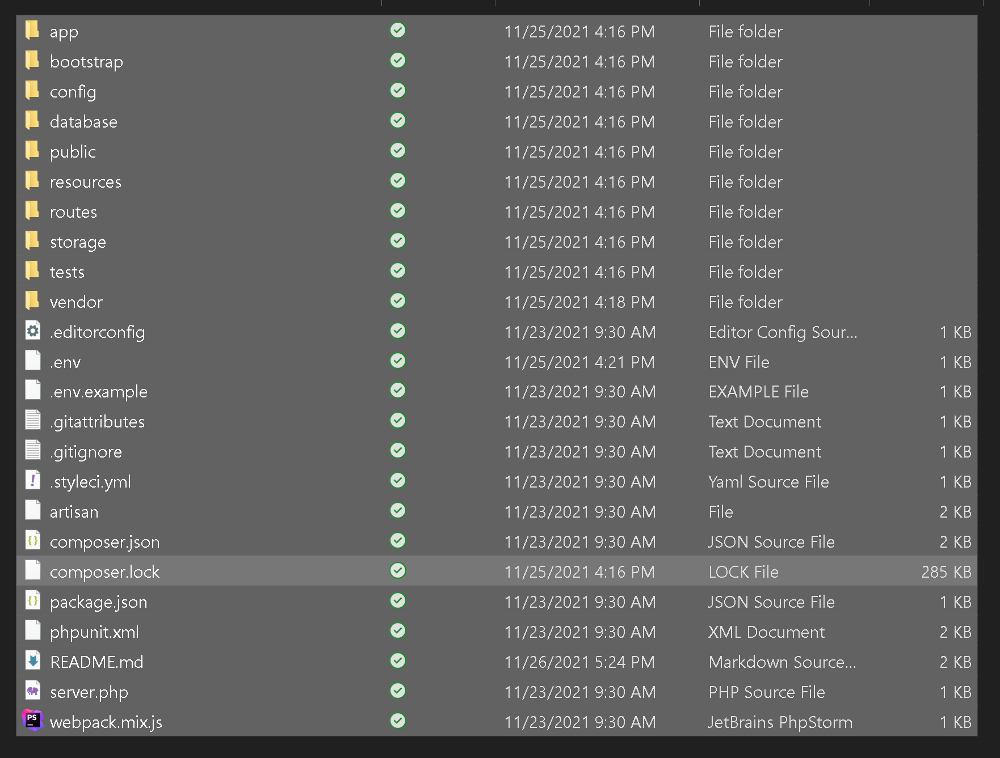
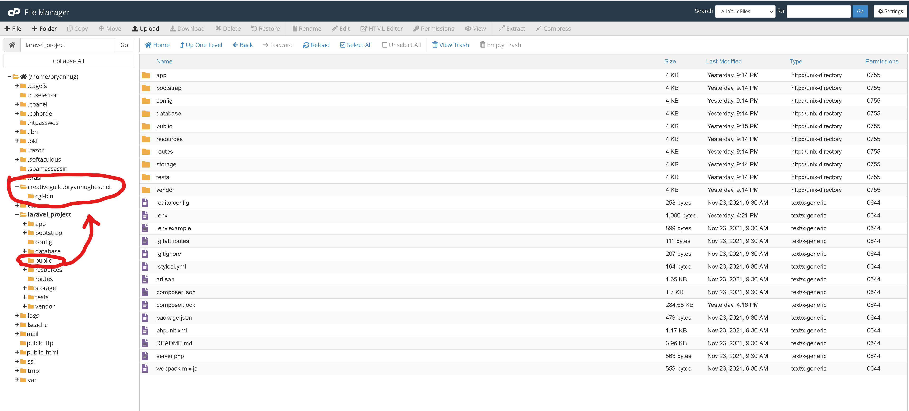

# Project Breakdown
#### Author: Bryan Hughes
#### Date Started: 11/23/2021
#### Date Finished: 11/28/2021

## Back-end
### **TODO:**
- [X] Install Laravel using Composer
- [X] Create a database on bryanhughes.net server.
- [X] Adjust the .ENV file to contain the hosted database connection credentials.
- [X] Draw the Entity-Relational Diagrams for the database.
- [X] Create the models for the two tables, have Laravel generate their migration files.
- [X] Write the migrations (database structure) for each table.
- [X] Adjust the *api.php* to contain a route for each model, and have the routes return all contents of each table.
- [X] Test the API.
- [X] Create the sub-domain for the project (creativeguild.bryanhughes.net).
- [X] Host the API.


## Hosting Steps:

1. Clear the project's ***cache*** in the command line with:

   ```php
   php artisan cache:clear
   ```

2. Clear any potential pre-existing cache of the project's ***config-file*** in the command line with:

   ```php
   php artisan config:clear
   ```

3. Make a zip folder of just the project's contents, not it's parent folder:


4. Unzip this folder in a dedicated folder, server-side:


5. Move the contents of the projects ***public*** folder on the server to the sub-domains *creative-guild* directory:

6. Adjust the ***index.php*** file to reflect the server's path:


### **Challenges & Technology:**
 * I found working with Laravel for this project to be relatively straight-forward. I enjoyed working with Laravel, and in the future, would like to complete a similar project using Vue.js with it.
 * Laravel's documentation was very supportive for building the types of tables I needed.
 * I found hosting the back end of the project to be trickiest portion of the backend, but not too difficult, overall a great learning experience.
 * I enjoyed building the back-end.

## Front-End
### TO-DO:
- [X] Asynchronously fetch the artist data from the back-end.
- [X] Write functionality to take the artist's data, from the artists endpoint, and add HTML markup to it, wrap it in div's and append it to the main HTML element in the DOM tree.

- [x] Write functionality to take the album's data from the albums endpoint, iterate through each album, adding HTML markup, wrapping them in div's, and appending them to the DOM tree.
  
- [X] Style the project to appear like the wire frame provided by Creative Guild.
  
- [x] Upload (host) the project on personal sever.
- [x] Share the links with Creative Guild.

### **Challenges & Technology:**
- I decided to go with pure HTML, CSS and JavaScript for this.
- I would like to rebuild this in Vue.js. I think that using Vue components will be an advantage when scaling an app like this up.
- For this project, I went with what I was absolutely strongest with.
- I like the back end more than the front end, but however,  I enjoy working on both of them.