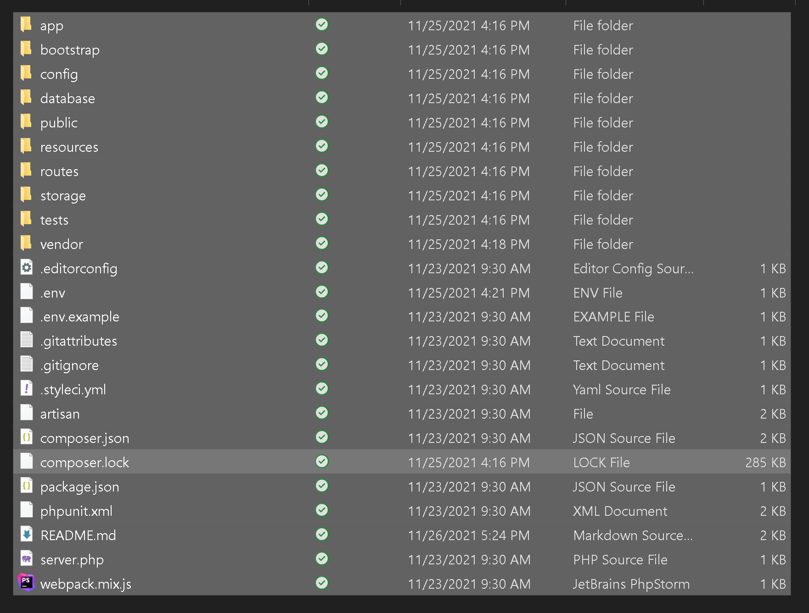
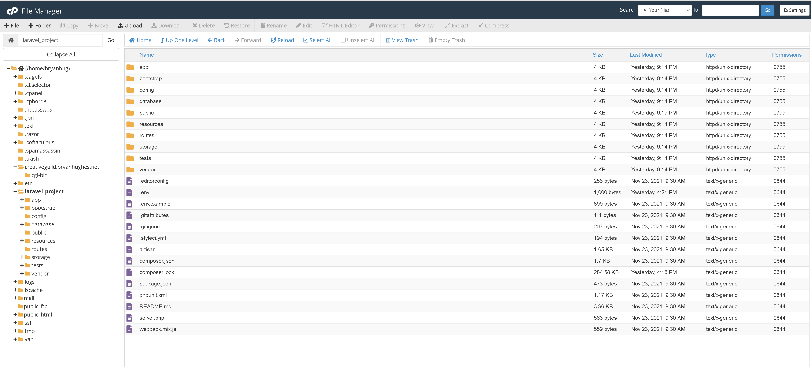
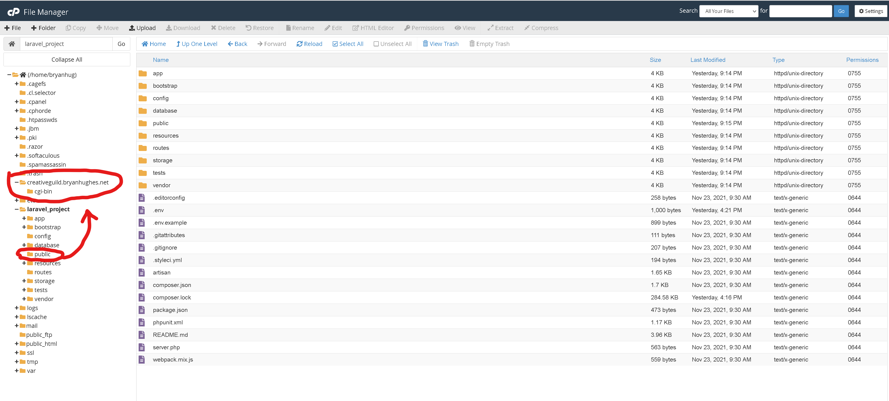
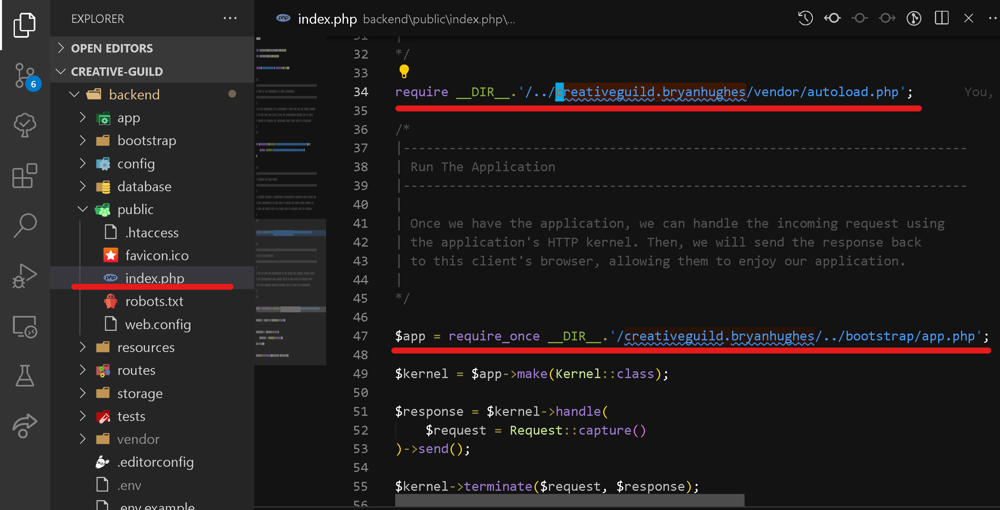

# Back-End Breakdown
#### Author: Bryan Hughes
#### Date Started: 11/23/2021
#### Date Finished: 11/26/2021
## **TODO:**
- [X] Install Laravel using Composer
- [X] Create a database on bryanhughes.net server.
- [X] Adjust the .ENV file to contain the hosted database connection credentials.
- [X] Draw the Entity-Relational Diagrams for the database.
- [X] Create the models for the two tables, have Laravel generate their migration files.
- [X] Write the migrations (database structure) for each table.
- [X] Adjust the *api.php* to contain a route for each model, and have the routes return all contents of each table.
- [X] Test the API.
- [X] Create the sub-domain for the project (creativeguild.bryanhughes.net).
- [X] Host the API.


## Hosting Steps:

1. Clear the project's ***cache*** in the command line with:

   ```php
   php artisan cache:clear
   ```

2. Clear any potential pre-existing cache of the project's ***config-file*** in the command line with:

   ```php
   php artisan config:clear
   ```

3. Make a zip folder of just the project's contents, not it's parent folder:


4. Unzip this folder in a dedicated folder, server-side:


5. Move the contents of the projects ***public*** folder on the server to the sub-domains *creative-guild* directory:

6. Adjust the ***index.php*** file to reflect the server's path:



## **Challenges & Triumphs:**
 * Although being slightly less formidable in the back-end as I am in the front-end, I found this project straight forward and relatively easy to complete.
 * Overall, I found Laravel very easy to use, especially on a simple API such as this. Laravel's documentation was very supportive for building the types of tables I needed.
 * I found hosting this project to be slightly tricky, but not too difficult, overall a great learning experience.
